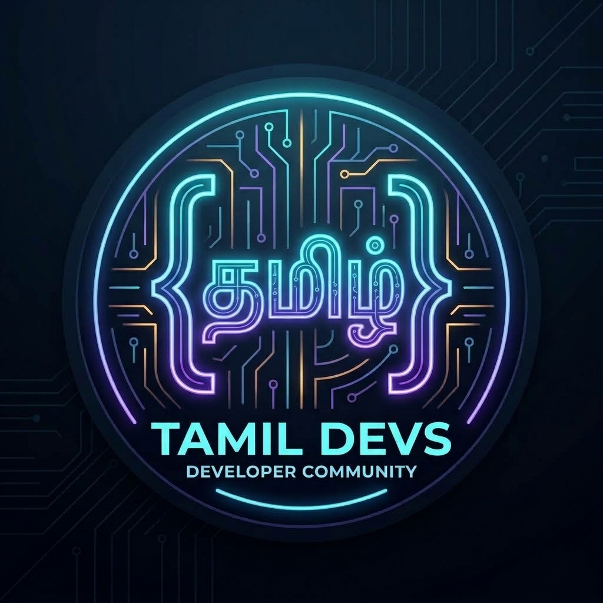

<div align="center">

  

  # Tamil Devs | தமிழ் Tech Community 🚀
  
  **The premier open-source tech community connecting Tamil software engineers, freshers, students, and tech enthusiasts worldwide.**

  [](https://tamil-devs.vercel.app)
  [](https://discord.gg/ucNesJ3P44)
  [](https://github.com/topics/tamil)
  [](CONTRIBUTING.md)
  [](LICENSE)

  <br />

  <p align="center">
    <a href="https://discord.gg/ucNesJ3P44"><b>👉 Click Here to Join the Discord Community</b></a> • 
    <a href="https://tamil-devs.vercel.app"><b>🌐 Visit the Official Website</b></a>
  </p>

</div>

---

## 🌟 வணக்கம் (Welcome)

**Tamil Devs** is a collaborative, zero-gatekeeping community built for Tamil developers across India, Singapore, Malaysia, Sri Lanka, Europe, North America, and around the globe. 

Whether you are writing your first line of code, preparing for FAANG/product company technical rounds, or architecting distributed cloud systems, this community provides a supportive space to collaborate, review code, share knowledge, and level up your career together.

---

## 💡 What We Do

| Feature | Description |
| :--- | :--- |
| 📄 **Resume Review & Roast** | Dedicated forum where members get constructive line-by-line feedback on formatting, bullet impact, and ATS optimization from working engineers. |
| 🎙️ **Peer Mock Interviews** | Practice real technical DSA, frontend architecture, and system design interviews in live voice rooms with peers. |
| 👀 **Code & Architecture Reviews** | Submit your GitHub Pull Requests, architecture diagrams, or tricky bugs for honest peer feedback. |
| 💼 **Jobs & Referrals** | Verified openings, employee referrals, and freelance contracts posted directly by community members across product companies and startups. |
| ✨ **AI & Modern Dev Workflows** | Hub for modern developer tools: Cursor rules, Claude Code, autonomous agents, and full-stack best practices. |

---

## 📂 Discord Server Architecture & Channels

```
📢 INFORMATION & WELCOME
├── 📜┃rules-and-guidelines      - Community code of conduct (Tamil & English)
├── 📢┃announcements             - Hackathons, meetups, and server updates
├── 👋┃introductions             - Say vanakkam and share your background
├── 🎭┃select-roles              - Auto-assign your domain & career roles
├── 📌┃curated-resources         - Free roadmaps, certifications, and toolkits
└── 💡┃community-suggestions      - Member-driven feature & event proposals

💬 COMMUNITY LOUNGE
├── 💬┃general-chat              - Everyday Tamil tech discussions & banter
├── 💡┃project-showcase          - Demos, SaaS launches, and open-source repos
├── 📢┃creators-and-promotions   - YouTube tutorials, blogs, and dev content
├── 📄┃resume-review-and-roast   📌 [FORUM] Line-by-line resume critique
└── ☕┃chill-and-memes           - Off-topic conversations & tech humor

💼 CAREERS & OPPORTUNITIES
├── 💼┃jobs-and-referrals        - Hiring posts & internal company referrals
├── 🙋┃looking-for-work          - Freshers & devs posting profiles to get hired
├── 💻┃freelance-and-contracts   - Upwork, US remote gigs, contracts, invoicing
└── 🚀┃startups-and-saas         - Indie hacking, MVP building, and marketing

💻 CORE ENGINEERING
├── 💻┃fullstack-dev             - Next.js, React, Node.js, Express, PostgreSQL
├── ⚙️┃backend-and-apis          - Go, Java/Spring, Python, System Design, REST
├── 🎨┃frontend-and-uiux         - CSS tricks, Tailwind, UI architecture, Figma
├── ⚡┃systems-and-lowlevel      - C, C++, Rust, Zig, Linux kernel, OS dev
├── ☁️┃cloud-devops-security     - Docker, K8s, AWS, GCP, CI/CD, Cybersecurity
├── 📱┃mobile-app-dev            - Flutter, React Native, iOS Swift, Android
├── 👀┃code-review               📌 [FORUM] Pull Request & code architecture
├── 🧮┃dsa-and-interviews        - LeetCode patterns, OA prep, System Design
└── 🆘┃code-help-and-debug       - Fast debugging and error troubleshooting

🔬 AI, HARDWARE & FUTURE TECH
├── ✨┃vibe-coding-and-tools     - Cursor, Claude Code, Windsurf, AI workflows
├── 🤖┃genai-and-llms            - RAG, Ollama, local models, LangChain, Agents
├── 🧠┃ai-ml-and-data            - PyTorch, Machine Learning, Data Science
├── 🔌┃hardware-and-iot          - Arduino, ESP32, Raspberry Pi, Robotics
└── 🌐┃open-source-learn-collab  - Beginners learning FOSS & Tamil projects

🎙️ VOICE & INTERVIEWS
├── ☕ 🔊 Chill Lounge
├── 💻 🔊 Silent Study & Co-Working (Lofi beats & shared focus)
├── 🎙️ 🔊 Mock Interview Room 1 & 2
└── 🏟️ 🔊 Tech Talk Stage (Live community AMAs & presentations)
```

---

## 🌐 Community Website & Open Source Repository

This repository powers the official landing page and resource hub at [**tamil-devs.vercel.app**](https://tamil-devs.vercel.app).

### 🛠️ Tech Stack
* **Framework:** [Next.js](https://nextjs.org/) (App Router, Turbopack)
* **Library:** [React](https://react.dev/)
* **Styling:** [Tailwind CSS](https://tailwindcss.com/)
* **Animations:** [Framer Motion](https://www.framer.com/motion/)
* **Icons:** [Lucide Icons](https://lucide.dev/)
* **Theme:** System, Dark, and Light mode with zero FOUC
* **Deployment:** [Vercel](https://vercel.com)

### 💻 Local Development Setup

To run the website locally on your machine:

1. **Clone the repository:**
   ```bash
   git clone https://github.com/Nithwin/tamil-devs.git
   cd tamil-devs
   ```

2. **Install dependencies:**
   ```bash
   npm install
   ```

3. **Start the development server:**
   ```bash
   npm run dev
   ```

4. **Open in browser:**
   Open [http://localhost:3000](http://localhost:3000) to view the site.

5. **Build for production:**
   ```bash
   npm run build
   ```

---

## 📚 Curated Tamil Tech Resources

A handpicked collection of top Tamil tech content creators and open-source educators:

* **Error Makes Clever** — Full-stack web development, Python, JavaScript, and beginner-friendly coding tutorials in Tamil.
* **Tutor Joes Stanley** — Comprehensive language deep-dives (C, C++, Java, PHP, Python) with extensive Tamil playlists.
* **Let's Make Engineering Simple (LMES)** — Conceptual science and engineering fundamentals explained visually in Tamil.
* **Code With Aravind** — Modern web frameworks, React, and frontend development.
* **Cyberdude Networks** — Web development, UI/UX, and software tooling in Tamil.

*(Want to suggest a creator or project? Submit a PR!)*

---

## 🤝 Contributing

We welcome contributions of all kinds!
- 🎨 **Website improvements:** Enhancing UI/UX, adding sections, fixing bugs, and improving SEO/accessibility.
- 📚 **Resource curation:** Adding high-quality Tamil tech channels, roadmaps, tools, and open-source projects.
- 💬 **Community help:** Participating in Discord discussions and reviewing peer PRs/resumes.

Please review our [Contributing Guidelines](CONTRIBUTING.md) to get started.

---

## 📜 Code of Conduct

We are dedicated to providing a friendly, safe, respectful, and harassment-free environment for everyone. Please read our [Code of Conduct](CODE_OF_CONDUCT.md).

---

## 🔗 Connect With Us

* 💬 **Discord Community:** [https://discord.gg/ucNesJ3P44](https://discord.gg/ucNesJ3P44)
* 🌐 **Official Website:** [https://tamil-devs.vercel.app](https://tamil-devs.vercel.app)
* 🐙 **GitHub Repository:** [https://github.com/Nithwin/tamil-devs](https://github.com/Nithwin/tamil-devs)

---

<div align="center">
  <sub>Built with ❤️ by the Tamil Devs community worldwide.</sub>
</div>
